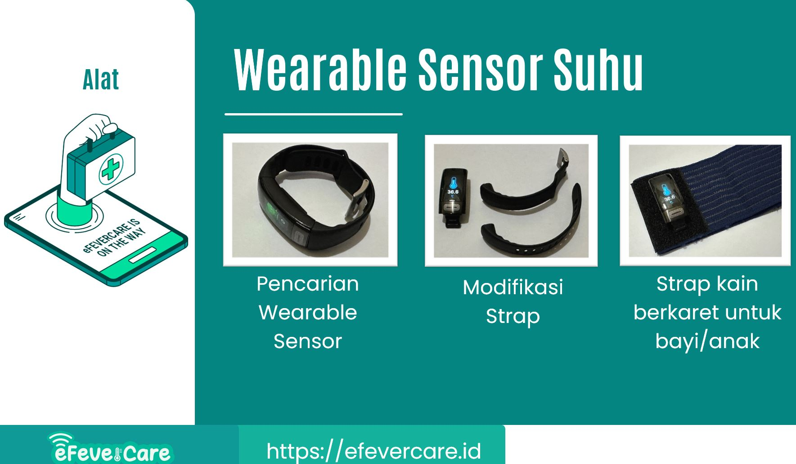

# eFeverCare Mobile
eFeverCare: Sistem Monitoring Demam Bayi atau Anak. Sistem ini terbagi dua yaitu aplikasi mobile dan aplikasi web. Aplikasi mobile mempunyai fungsi utama untuk terkoneksi dan mengambil data suhu tubuh dari alat berupa wearable sensor berbentu jam tangan.

