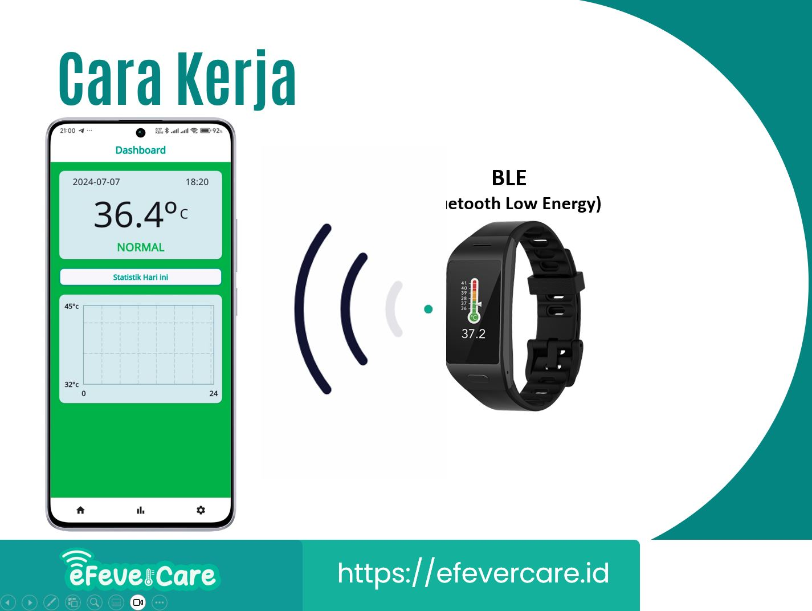
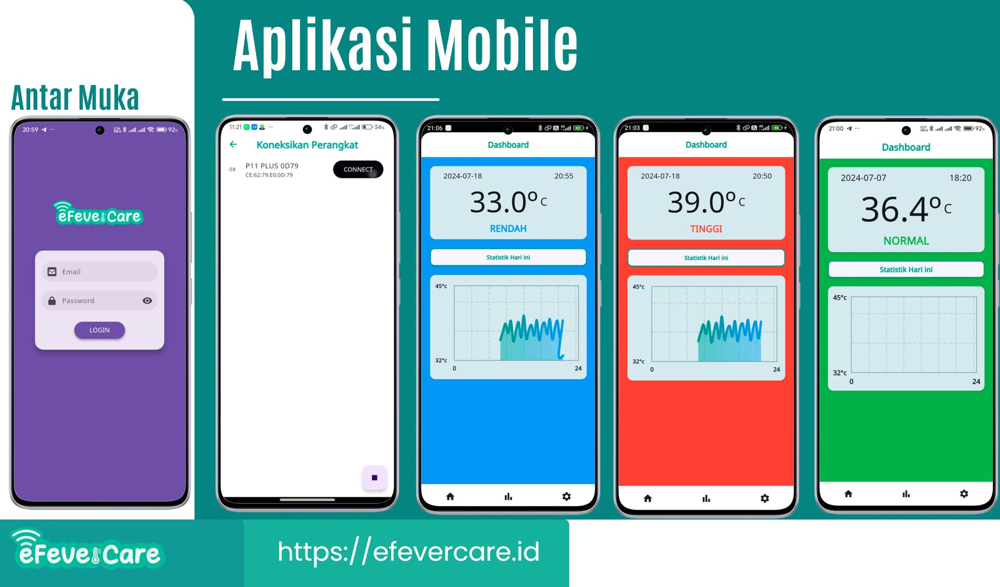

# eFeverCare Mobile
eFeverCare: Sistem Monitoring Demam Bayi atau Anak. Sistem ini terbagi dua yaitu aplikasi mobile dan aplikasi web. Aplikasi mobile mempunyai fungsi utama untuk terkoneksi dan mengambil data suhu tubuh dari alat berupa wearable sensor berbentuk jam tangan.

Pengiriman data pengukuran suhu tubuh dari wearable sensor ke aplikasi mobile dilakukan menggunakan Bluetooth Low Energy (BLE)

Setelah aplikasi mobile menerima data suhu tubuh maka ditampilkan pada layar aplikasi. Jika suhu tubuh di rentang suhu normal maka warna latar layar menjadi warna hijau. Sedangkan jika suhu tubuh di bawah rentang normal atau di atas rentang normal maka warna latar menjadi hijau atau merah.  

